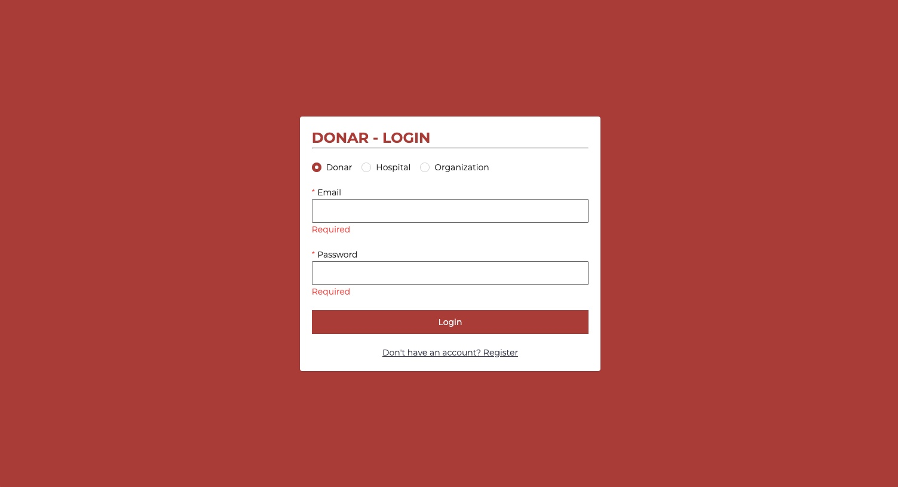
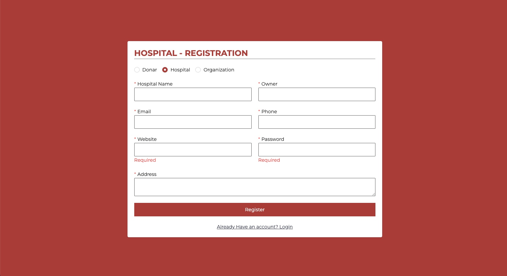
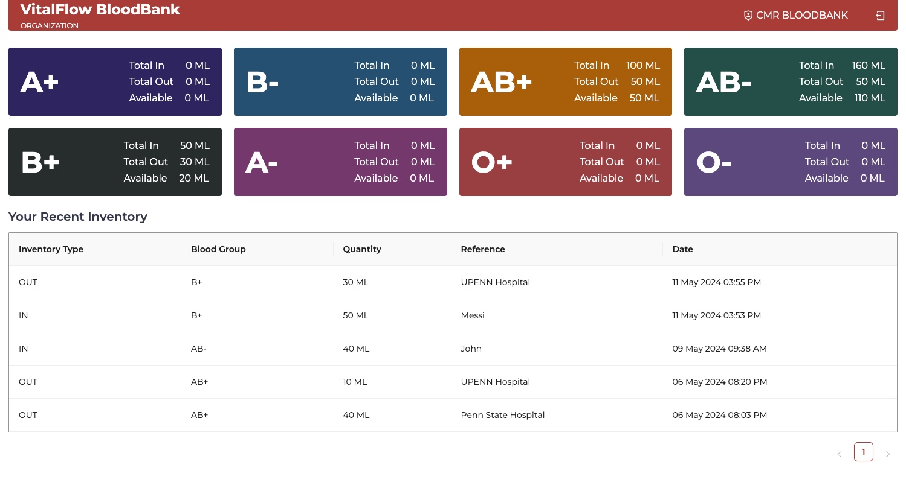
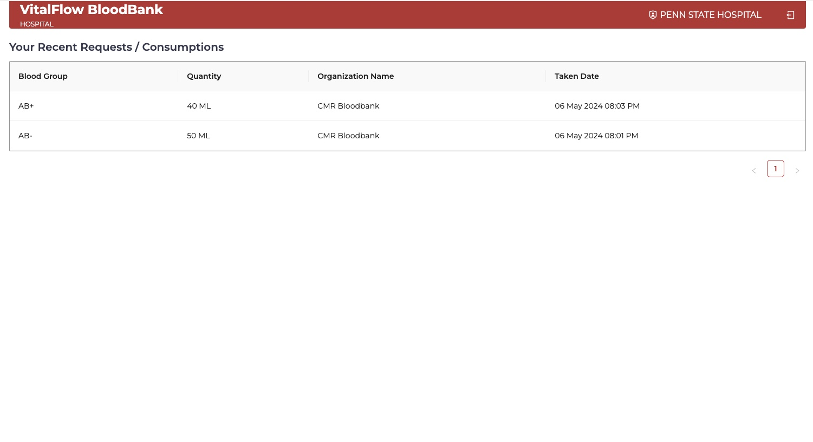
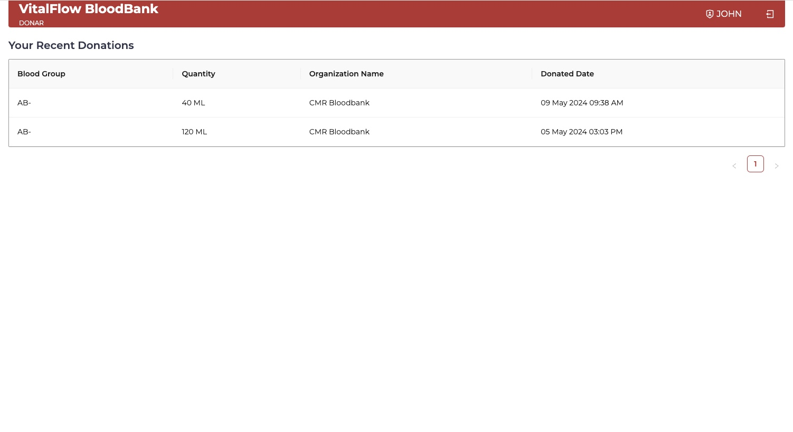

# VitalFlow BloodBank

The Blood Bank Management System is a comprehensive application designed to streamline the management of blood donation-related activities. It allows users to manage inventory, users, and organizations involved in blood donation, making it easier to track and organize blood donations and inventory.

## Features

- **Inventory Management:** Users can view and manage the inventory of blood groups, including total in, total out, and available quantities.
- **User Management:** The system allows for the management of users, including organizations, donors, and hospitals.
- **Organization Dashboard:** Organizations can view their recent inventory and manage their blood group inventory.
- **Donor Dashboard:** Donors can view their recent donations.
- **Hospital Dashboard:** Hospitals can view their recent requests and consumptions.

## Technologies

- **Frontend:** React (bootstrapped with Create React App), Redux for state management, and Tailwind CSS for styling.
- **Backend:** Node.js with Express.js for handling server routes and MongoDB for database storage.

## Setup

### Prerequisites

- Node.js installed on your machine.
- MongoDB database running.

### Installation

1. Clone the repository to your local machine.
2. Navigate to the project directory.
3. Install the frontend dependencies by running `npm install` in the `client` directory.
4. Install the backend dependencies by running `npm install` in the `server` directory.
5. Set up environment variables as needed, particularly for database connections and JWT secret.
6. Start the MongoDB database.
7. Start the backend server by running `npm run start` in the `server` directory.
8. Start the frontend application by running `npm start` in the `client` directory.

## Deployed Link

[Deployed Link: https://vitalflow-bloodbank.onrender.com](https://vitalflow-bloodbank.onrender.com)

## Screenshots

## Contributing

Contributions to the Blood Bank Management System are welcome. Please feel free to submit a pull request or open an issue if you encounter any problems.

## License

This project is licensed under the MIT License. See the `LICENSE` file for more details.